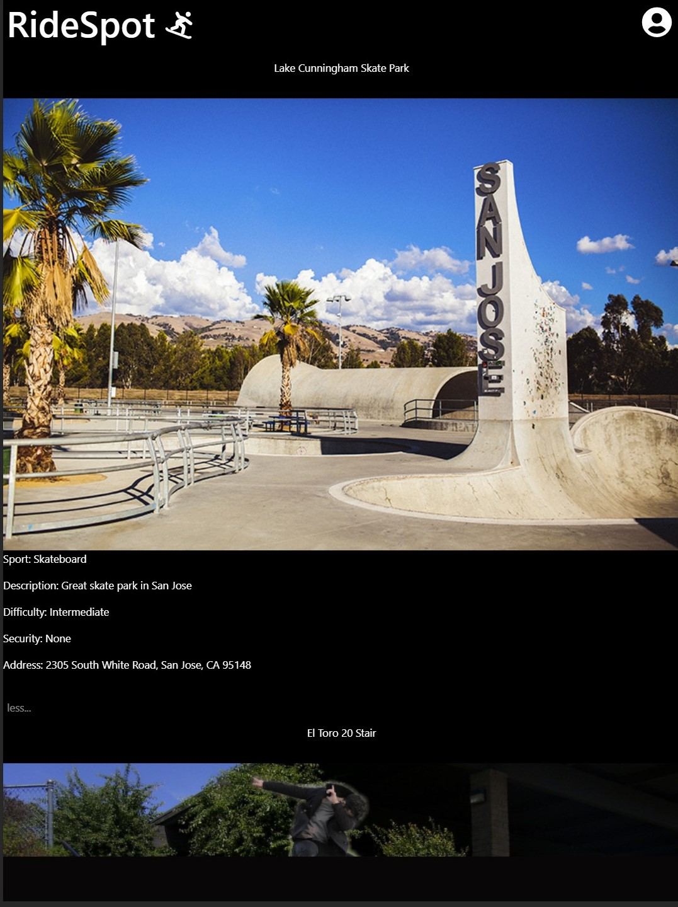
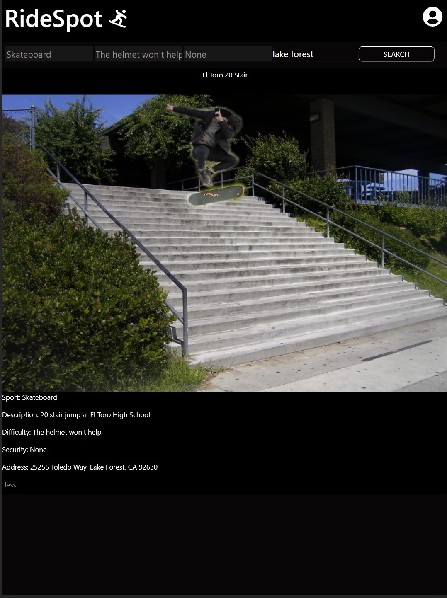
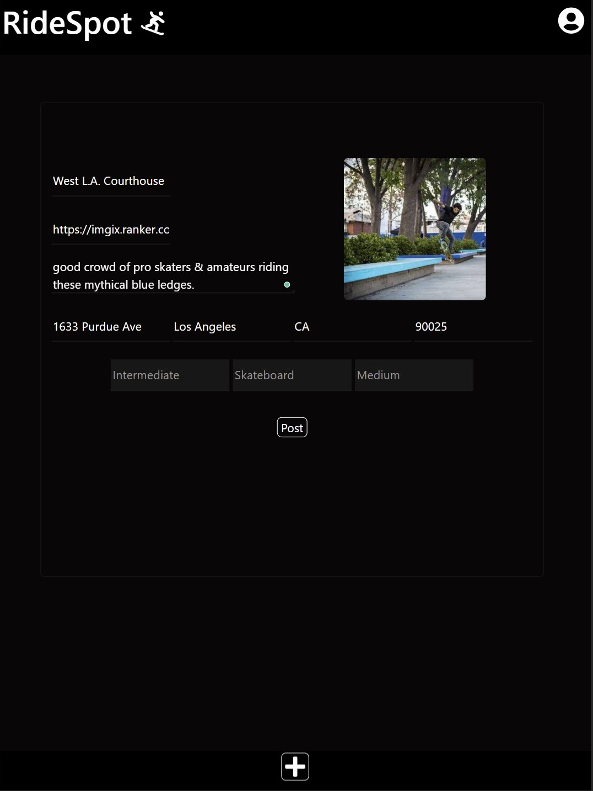

# RideSpot client

Play with the live app at https://ridespot.vercel.app/

RideSpot is a community of users who can post their favorite spots to skateboard, scooter, bike, or rollerblade.

Users can filter the list of spots by location as well as difficulty, sport, and even security level.

No account is required to view the current spot list however for users to post and store their own spots they must make an account.

The front end of the app was created using React, JavaScript, and CSS.

